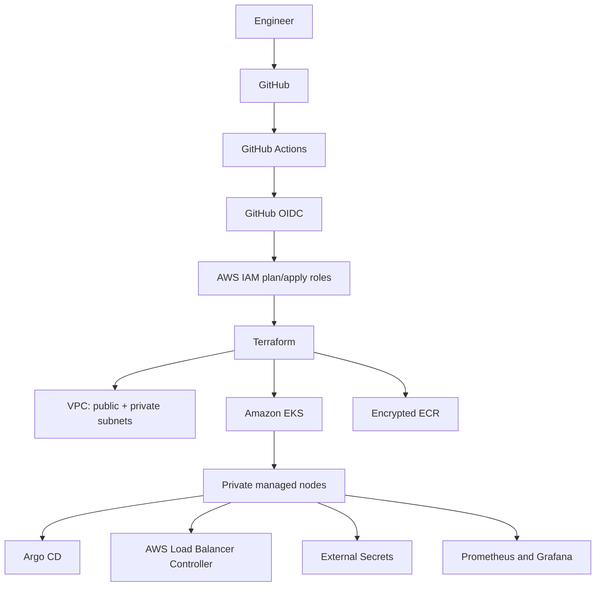

# Terraform AWS EKS Platform

**Production-style AWS Kubernetes platform using Terraform, Amazon EKS, GitHub Actions, OIDC, GitOps, security controls, and observability.**

This portfolio repository builds a multi-AZ AWS network, private EKS workers, managed node groups and add-ons, scoped workload identities, ECR, remote state, budgets, and a GitOps-ready Kubernetes platform. Durable AWS infrastructure is separated from Helm/Kubernetes delivery so cluster recovery is not coupled to add-on health.



## Highlights

- Two or three AZs; public load-balancer subnets and private node subnets; single-NAT cost mode or NAT-per-AZ availability mode.
- EKS access API, configurable private/public endpoints and control-plane logs, OIDC/IRSA, EBS CSI, CoreDNS, kube-proxy, and VPC CNI.
- System, application, and Spot node patterns with rolling updates, labels, optional taints, and no SSH exposure.
- Argo CD, ALB Controller, Metrics Server, External Secrets, optional ExternalDNS, and optional kube-prometheus-stack.
- Restricted sample workload with probes, limits, HPA, PDB, encrypted gp3 storage, ingress, and NetworkPolicies.
- S3 native state locking (`use_lockfile`), versioning, encryption, TLS-only policy, and blocked public access.
- PR checks, OIDC plan/apply, protected environments, manual destroy, security scans, and drift detection.

## Repository map

`terraform/modules` contains reusable infrastructure. `terraform/environments/{dev,staging,prod}` are thin compositions and inputs. `terraform/bootstrap/remote-state` creates the state bucket. `kubernetes` contains manifests, `helm` reviewed values, `scripts` guarded operations, and `docs` design/runbooks.

## Requirements

Terraform >= 1.10, AWS CLI v2, kubectl, Helm 3, Git, TFLint, Trivy, and Checkov are recommended.

```bash
terraform version
aws --version
kubectl version --client
helm version
tflint --version
trivy --version
checkov --version
```

Use an AWS role with permission to bootstrap S3 and provision the resources. Never use the root user. AWS CLI authentication can use SSO: `aws sso login --profile platform-admin && export AWS_PROFILE=platform-admin`.

## Bootstrap and deploy dev

```bash
git clone https://github.com/YOUR_ORG/terraform-aws-eks-platform.git
cd terraform-aws-eks-platform
aws sts get-caller-identity
cp terraform/bootstrap/remote-state/terraform.tfvars.example terraform/bootstrap/remote-state/terraform.tfvars
./scripts/bootstrap.sh
terraform -chdir=terraform/bootstrap/remote-state apply bootstrap.tfplan
terraform -chdir=terraform/bootstrap/remote-state output
cp terraform/environments/dev/backend.hcl.example terraform/environments/dev/backend.hcl
cp terraform/environments/dev/terraform.tfvars.example terraform/environments/dev/terraform.tfvars
# Edit backend.hcl, tfvars, trusted CIDR, region/AZs, and admin role.
make validate
make plan ENV=dev
make apply ENV=dev
make kubeconfig ENV=dev
make install-platform ENV=dev
make verify ENV=dev
```

Set `ENABLE_MONITORING=true` for Prometheus/Grafana. ExternalDNS is opt-in and requires scoped Route 53 zone ARNs. Replace every `REPLACE_*` placeholder. Real secrets belong in Secrets Manager, not Git.

## CI/CD and access

Configure GitHub Environments named `dev`, `staging`, `prod` and `*-plan`. Store `AWS_REGION`, `AWS_PLAN_ROLE_ARN`, `AWS_APPLY_ROLE_ARN`, and `TF_STATE_BUCKET` as environment variables; store a JSON object of non-secret and sensitive Terraform inputs as the masked `TF_VARS_JSON` environment secret. Protect production with required reviewers. PRs validate and plan only; apply and destroy are manual. See [GitHub OIDC](docs/github-oidc.md) and [IAM](docs/iam.md).

EKS admin, developer, CI, and read-only access should use separate EKS access entries and the narrowest EKS access policy. The module demonstrates an admin entry. Workloads use IRSA and never static keys.

## Security, reliability, and observability

Workers have no public IPs. Prod disables the public API by default, uses NAT per AZ, three system nodes, full logs, rolling updates, and PDBs. The sample ALB intentionally exposes HTTP; add ACM HTTPS, DNS, WAF, and redirects for production. NetworkPolicy enforcement requires the VPC CNI network-policy feature or another compatible engine.

Prometheus/Grafana is optional because it consumes compute and storage. Alerts use sustained windows. Recommended logs are Fluent Bit or Alloy → Loki → Grafana. See [security](docs/security.md), [observability](docs/observability.md), and [architecture](docs/architecture.md).

## Cost and cleanup

EKS control planes, EC2, NAT Gateways (hours and data), ALBs, EBS, and CloudWatch logs incur ongoing charges. Dev uses small/Spot capacity, one NAT, short retention, and optional monitoring. Prices vary; use AWS Pricing Calculator and budgets.

```bash
make kubeconfig ENV=dev
make destroy ENV=dev
```

The destroy script removes ingress/controllers before Terraform to avoid VPC dependency failures. Retain remote state under your audit policy. See [cost optimization](docs/cost-optimization.md), [disaster recovery](docs/disaster-recovery.md), [troubleshooting](docs/troubleshooting.md), and the [interview guide](docs/interview-guide.md).

## Enterprise evolution

Next steps include multi-account Organizations/Control Tower, centralized state/logging, Transit Gateway and PrivateLink, CloudTrail/GuardDuty/Security Hub, WAF/Shield, Karpenter, policy-as-code, service mesh, Crossplane, and tested multi-region data strategies. They remain optional to keep ownership and cost explicit.
