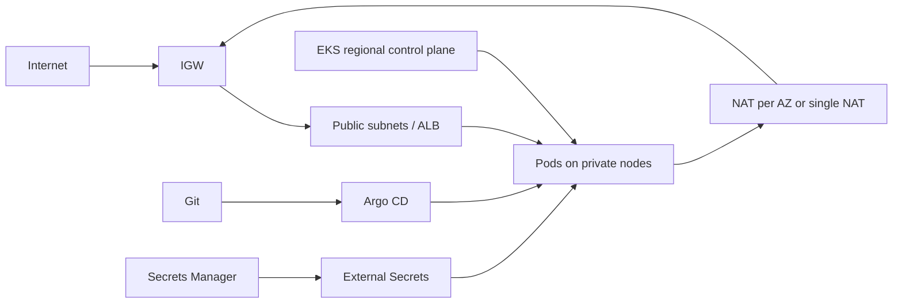

# Architecture

Terraform owns AWS primitives; Helm and Argo CD own in-cluster software. This boundary makes the cluster reproducible without placing Kubernetes provider state in the same dependency graph as EKS.

Dev optimizes cost; staging exercises production-like capacity; prod uses three AZs, NAT per AZ, multiple replicas, private API access, and longer audit retention. EKS control-plane HA does not make workloads HA: replicas, topology distribution, PDBs, autoscaling, resilient dependencies, and tested restoration are still required.

Enterprise extensions include multi-account landing zones, Transit Gateway, PrivateLink, WAF/Shield, GuardDuty/Security Hub, CloudTrail, centralized logs/state, Karpenter, service mesh, policy-as-code, Crossplane, and multi-region failover.
